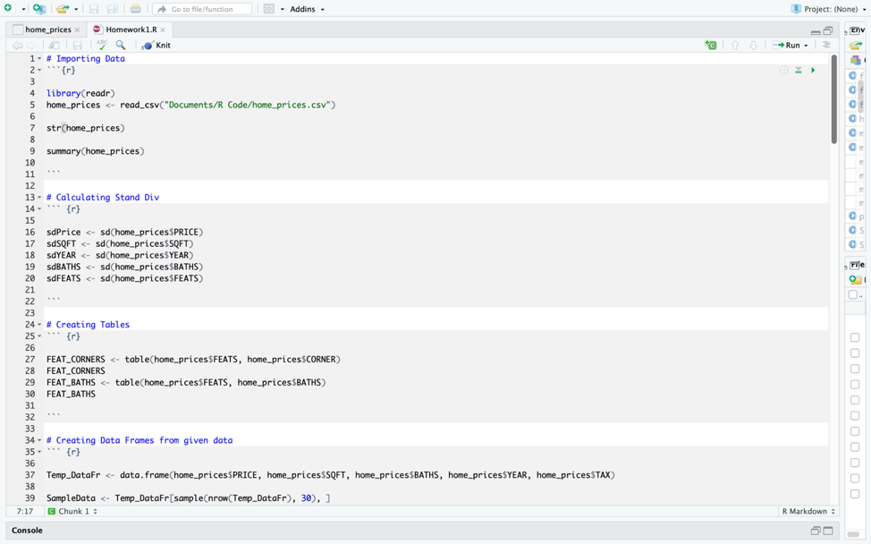

# Analyzing-Home-Data-R
Here we analyze and calculate statistical values given a dataset of home prices that include information about the number of baths, bedrooms, year, square-feet, taxes, and other features.

