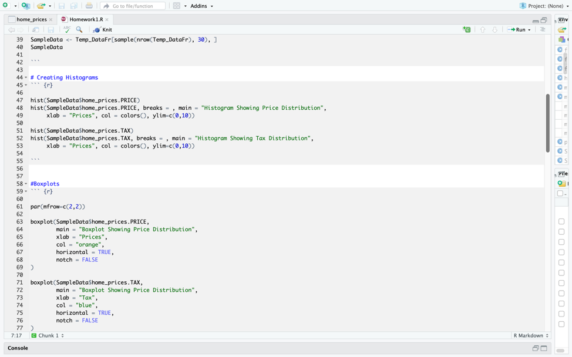
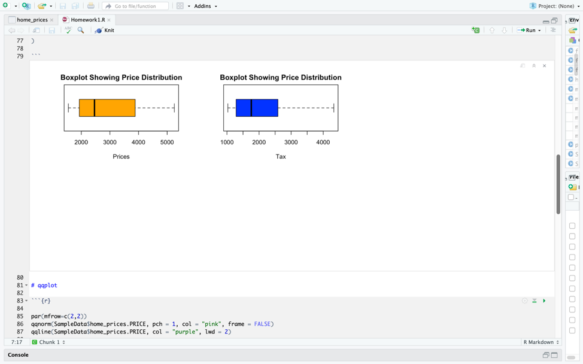
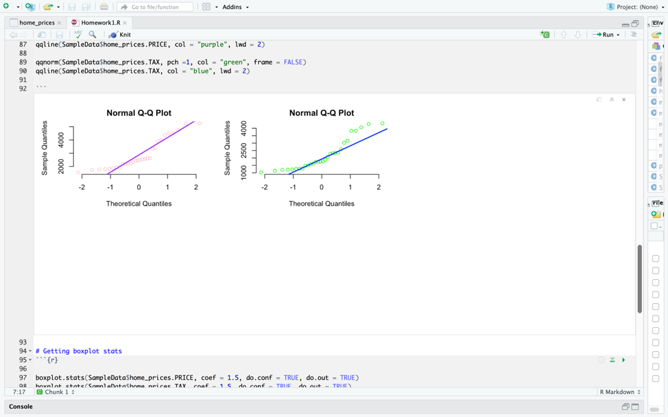
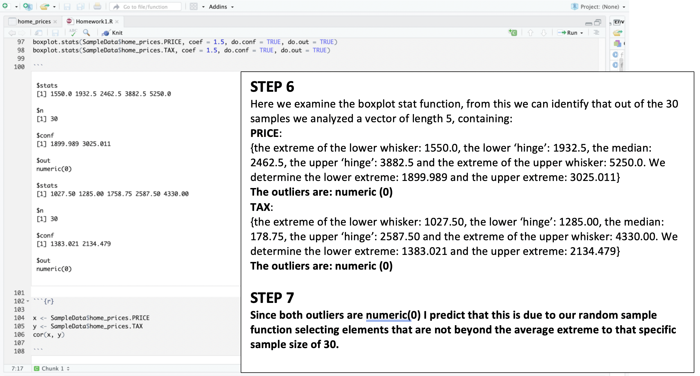
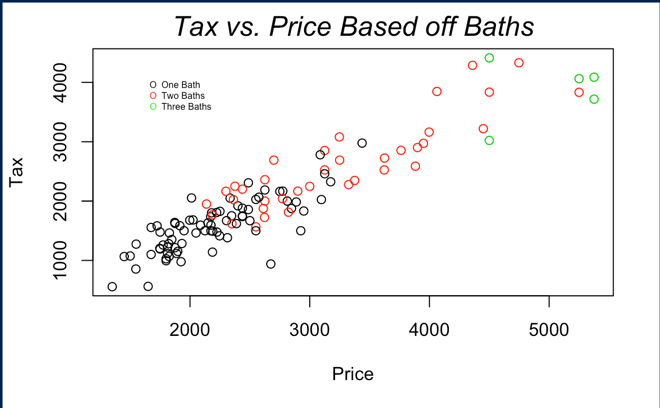
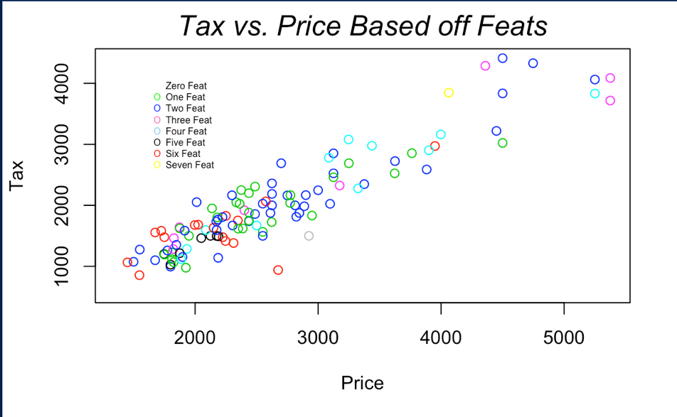
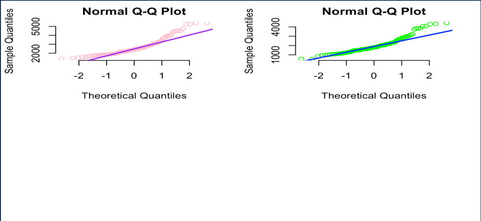

# Analyzing-Home-Data-R
Here we analyze and calculate statistical values given a dataset of home prices that include information about the number of baths, bedrooms, year, square-feet, taxes, and other features.

The images below illistrate the execution of the project.

Here we see **boxplots** for home price distibutions (For general price and taxes)

Here we see **normal Q-Q plots** for home price distibutions (For general price and taxes)

### In more depth we see the following:

##### HISTOGRAM:
PRICE: We observe that it is more frequent for homes to be prices between 150k-300k on average.
TAX: We observe that most people pay around 100k-250k in taxes on average.

##### BOXPLOTS:
PRICE & TAX: We observe that there are about 3 outliers for prices, and at least 6 or more outliers for taxes. This means that some people are paying a lot more than in house prices and taxes than the larger majority.

##### QQPLOTS: 
PRICE & TAX: We observe that most of the housing prices and taxes tend to have a linearly normal distribution.

##### BOXPLOT.STATS:
PRICE & TAX: We observe that there are 117 elements we are studying for prices and tax. We see that the lower whisker for price is 1350, the lower hinge is 1950, the median is 2400, the upper hinge is 3000, the upper whisker is 4500. For tax, we see that the lower whisker for price is 557.5, the lower hinge is 1477.5, the median is 1807.5, the upper hinge is 2307.5, the upper whisker is 3220.0. The lower and upper bound of price are 2446.25 and 2553.375, respectively. The lower and upper bound of tax are 1686.261 and 1928.739, respectively. The outliers for price is as follows: 5230.0, 5250.0, 5375.0, 4747.5, 5375.0. The outliers for price is as follows: 3847.5, 4062.5, 3832.5, 3717.5, 3835.0, 4287.5, 4330.0, 4087.5, 4412.5.
 

### Further analysis:

I believe that that biggest thing that affects price of the house is home many bathrooms a house has. When we examine the graph below we notice that the more bathroom there are the higher a person is paying for that house.

                    
If you run this analysis as a market analysis of a specific town, I would drop the houses that payed an extremely larger or smaller amount for the houses from my analysis, because these extreme would cause the true data to skew more than it should.

Other information I would need to know the location and income of the locals to analyze better prices for the houses.

Assume that I have three type of customers, those who request luxurious houses, those who prefer simple houses and those who want the best house their money can buy. The easiest factor to determine who these customers are is to examine our data and houses based off necessity. Those who want luxury homes might tend to purchase homes that are larger and have more bathrooms and features. Those who want a simple home would most likely purchase a home that has one bathroom, less features, and a smaller size. Those who want the best home their money can buy would be in the middle of these two extremes and have a modest home of maybe one to two bathrooms, and average size home, with moderate features. 

More information would be helpful to support my thesis, but I do not believe it is necessarily impossible to do this without it. 

### The data above helps support our **hypothesis** that:

Those who want luxury homes might tend to purchase homes that are larger and have more bathrooms and features. Those who want a simple home would most likely purchase a home that has one bathroom, less features, and a smaller size. Those who want the best home their money can buy would be in the middle of these two extremes and have a modest home of maybe one to two bathrooms, and average size home, with moderate features. 

